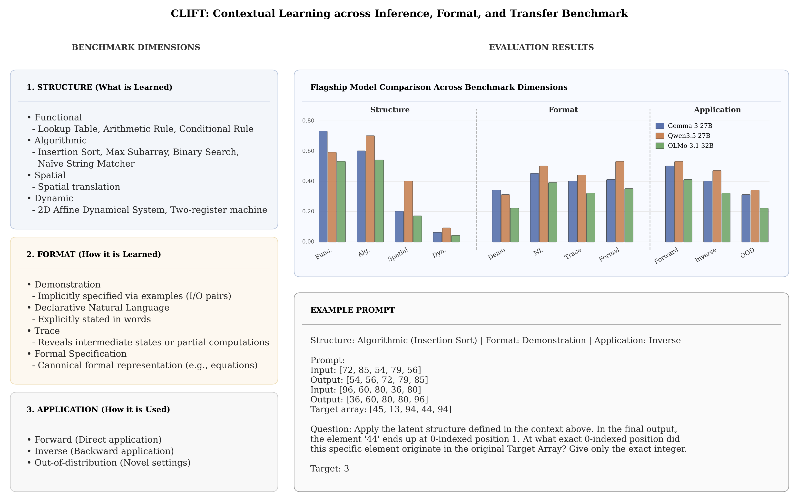

# CLIFT: A Benchmark for Contextual Learning across Inference, Format, and Transfer




## Install

Install [uv](https://docs.astral.sh/uv/) and run:

```bash
uv sync
```

Core generation works without CLRS. Tasks **`insertion_sort`** and **`binary_search`** use the optional `clrs` sampler; install it with:

```bash
uv sync --extra clrs
```

Development tools (pytest, ruff):

```bash
uv sync --group dev --extra clrs
```
